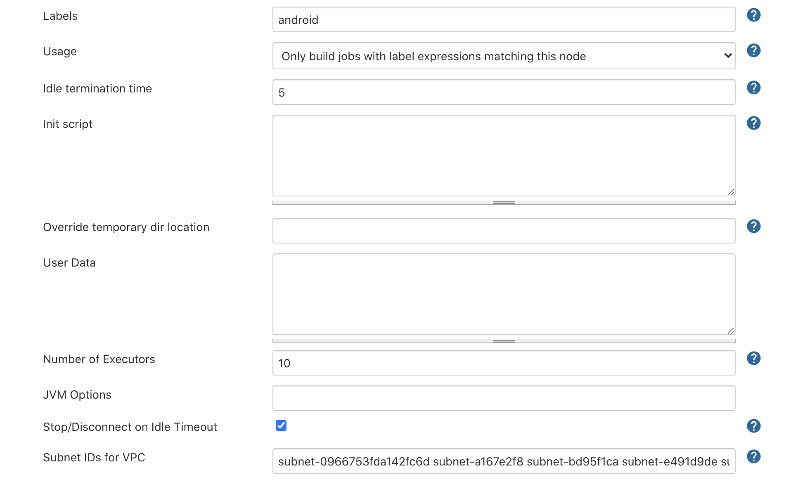
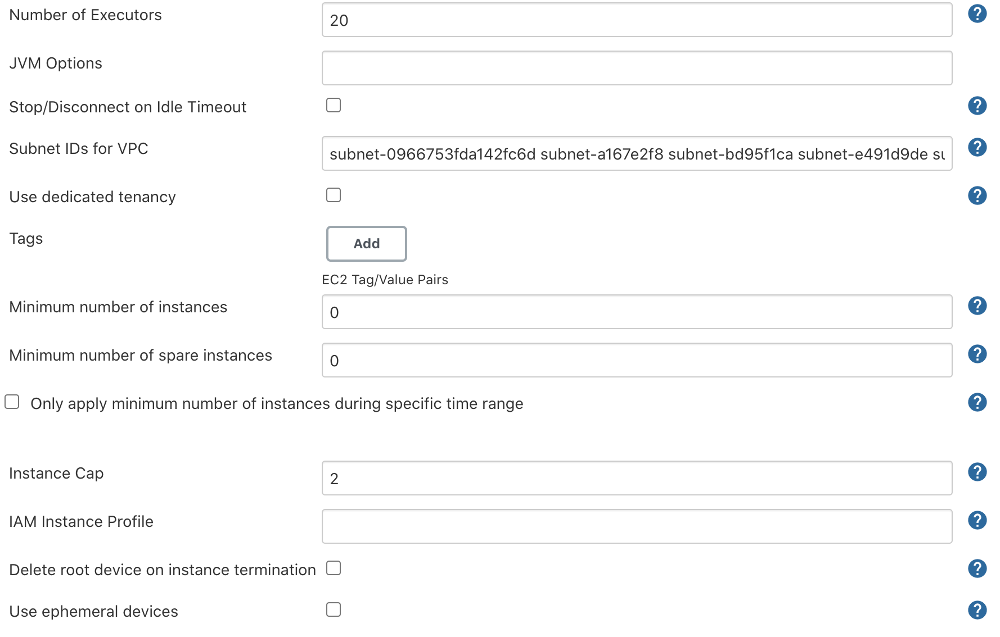

# Jenkins setup

### Local setup
For this demo I'm running Jenkins locally. You can repeat that like: 
```shell
docker run \
-p 8080:8080 \
-p 50000:50000 \
-v ~/jenkins_local:/var/jenkins_home \
jenkins/jenkins:2.262-jdk11
```

**Don't use local Jenkins for production!**

### Plugins
You will need:
- All plugins with `Pipeline` in the name
- All plugins with `Blue Ocean` in the name
- https://plugins.jenkins.io/ec2/ (alternatively you can use https://plugins.jenkins.io/ec2-fleet/)
- https://plugins.jenkins.io/aws-device-farm/ (Optional, if you want to use Jenkins plugin to run tests on AWS Device Farm)

### Setup MacOS build node
- Go to `Manage Jenkins` -> `Manage Nodes and Clouds` -> `New Node` or [http://<your_host>/computer/new](http://<your_host>/computer/new)
- Setup your node like:

- Go to [http://<your_host>/computer/macos/](http://<your_host>/computer/macos/) from MacOS node and download `agent.jar`
- Run `agent.jar` like:
```shell
java -jar agent.jar \
-jnlpUrl http://localhost:8080/computer/macos/slave-agent.jnlp \
-secret <your_secret> \
-workDir "/Users/artemnikitin/jenkins_agent"
```

### Setup AWS build nodes
- Go to [http://<your_host>/credentials/](http://<your_host>/credentials/) and add AWS credentials (use `AWS credentials` type) and SSH keypair
- Go to [http://<your_host>/configureClouds/](http://<your_host>/configureClouds/)
- Minimal configuration will look like:

Button `Test Connection` should return `Success`




