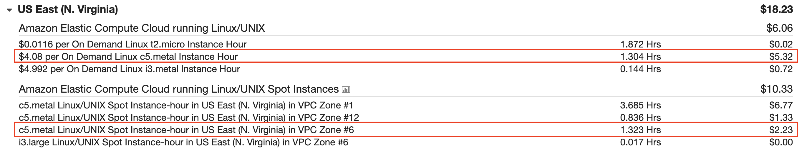

# Potential improvements

This demo wasn't long enough to cover some of potential optimizations that can be done here.

### MacOS nodes
- Managing 1 or 2 node(s) manually is fine
- [Ansible](https://www.ansible.com/) can help with command line operations
- For system wide management (like OS updates or Xcode management) you will need something like [Jamf](https://www.jamf.com/)

### AWS nodes
- We are used in demo `c5.metal` x86 instance. They are crazy expensive!
- Spot instances is the way to keep things much more cheaper

- ARM instances like `a1.metal` are much better from cost/performance perspective
- We can periodically rebuilds base AMI to include up to date dependencies (Docker images and so on)

### Android builds
- Every time we are rebuilding base Docker image, we can do it better and build it once and pull in every job
- Or we can do even more better, and we can "bake in" it in base AMI and always have it on an instance
- Or we can do even more, we can also build Docker images with all deps and keep them up to date and "bake" them in base AMI
